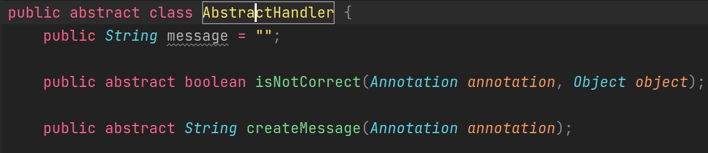
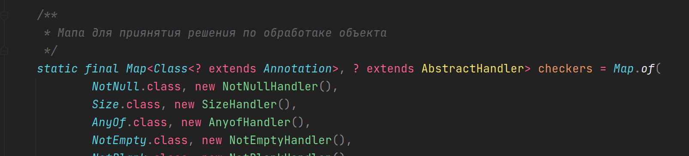

**Как Добавить новую аннотацию?**

Для добавления новых аннотаций в библитеку вам нужно создать свою аннотацию,
класс Handler(Наследний Abstract Handler),
который будет обрабатывать объекты помеченные вашей аннотацией

и добавить в статический мап в классе валидатора пару (Класс аннотации, Handler)

